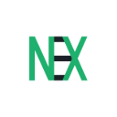

# nexstate

A simple and decentralized state management library.

[](https://npmjs.com/package/nexstate)
[](https://npmjs.com/package/nexstate)
[](https://github.com/Hawmex/nexstate/issues)
[](https://github.com/Hawmex/nexstate)

## Demo

You can try the demo [here](https://codepen.io/Hawmed/pen/PopmeOp).

## Installation

```
npm i nexstate
```

## Documentation

You can find documentation [here](https://hawmex.github.io/nexstate/).

## Example

```js
import { Store } from 'nexstate/nexstate.js';

class CounterStore extends Store {
  count = 0;

  increment() {
    this.setState(() => (this.count += 1));
  }
}

const counterStore = new CounterStore();
const subscriptionController = new AbortController();

counterStore.runAndSubscribe(() => console.log(counterStore.count), {
  signal: subscriptionController.signal,
});

counterStore.increment();
counterStore.increment();

setTimeout(() => subscriptionController.abort());
```
